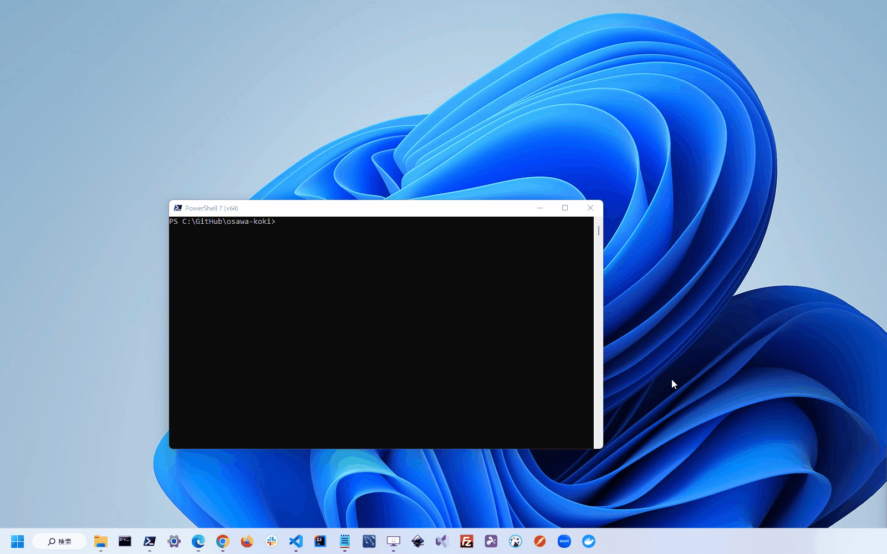

## Internet Explorerにさよならを、、、

Internet Explorerが正式にサポートを停止するということでお別れをしてきました。  
Windows11でも以下のコマンドで呼び出せるということでしたので、、、

```powershell
(New-Object -ComObject InternetExplorer.Application).Visible="true"
```

  

[僕のポートフォリオサイト](https://osawa-koki.github.io/osawa-koki/)はNext.jsという新しい技術を使用していますので、やっぱり正常に動作しない部分がありました。  

それにしても懐かしいアイコンとアプリケーションのデザインですね、、、  
高校を卒業して5年ぶりくらいに高校の最寄り駅に友達と集合して、散歩しているときに感じた感情と同じ感情を抱きました。  
