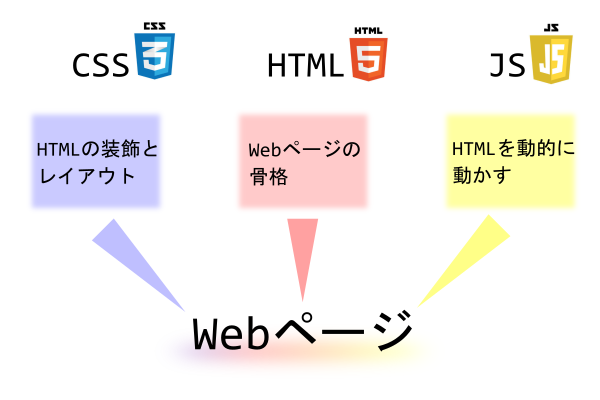
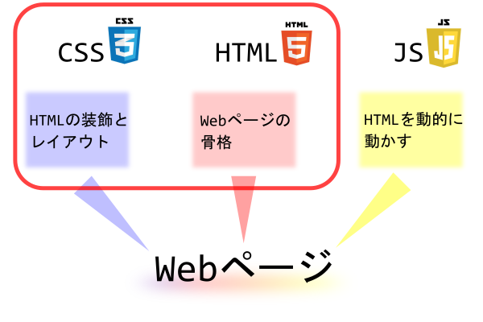
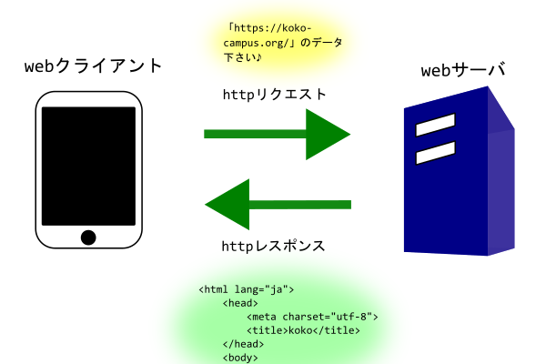

## HTML&CSSとは

HTMLとは「Hypertext Markup Language」の略で、テキストや画像・動画などを用いてwebサイトを作成する際に用いられます。  
CSSとは「Cascading Style Sheets」の略で単なるテキストであるHTMLをデザインを設定するために用いられます。  
一般的なWebサイトはこのHTML・CSSとJavaScriptで作成されます。  

  

ここではJavaScriptは扱わず、HTMLとCSSだけを勉強します。  
HTMLとCSSだけでも立派なwebページを作成できます。  
JavaScriptに関してはHTMLとCSSの知識が必要不可欠ですので、この授業が終了したら学習しましょう♪  

  

## webサイトとは

おそらくWebサイトと言えばなんとなくどんなものかイメージできる人が多いと思います。  
インターネットを用いてアクセス可能なHTMLで書かれたページと思ってください。  
このページもwebサイトです。  

一般的にはブラウザと呼ばれるアプリを通して閲覧します。  
代表的なブラウザとして、「Firefox」「Google Chrome」「Microsoft Edge」「Safari」があります。  

### 仕組み

Webサイトが表示されるには、Webクライアント(ブラウザ)がWebサーバに対してHTTPリクエストを送信して、Webサーバがそれに対してHTTPレスポンス(HTML + α)を返します。  
HTTPレスポンスに関してはWebサーバ(Apache/Nginx)などの知識が必要ですが、レンタルサーバを使用すれば特に意識することなくWebサイトが構築できるため、ここでは省略します。  

  

## URL(URI)

「Uniform Resource Locator(Identifier)」の略で、インターネット上のホストを一意に識別するために使用されます。  
インターネット上の住所としてIPアドレスがありますが、IPアドレスは単なる数字(IPv6では16進数の数字)ですのでなんだか美しくありません、、、  
企業のWebサイトを紹介するページで「127.0.0.1」って書いてあったら何だか、、、ですよね、、、  
「<https://github.com/>」の方が良いですよね。  

通常はレンタルサーバ(VPS)を契約する際に同時に契約します。  
特に難しい設定はありません。  
レンタルサーバとドメインを提供している会社を簡単に紹介しますね♪  

- [お名前ドットコム](https://www.onamae.com/)
- [さくらインターネット](https://www.sakura.ne.jp/)
- [ムームードメイン(ドメインのみ)](https://muumuu-domain.com/)
- [ロリポップ(サーバのみ)](https://lolipop.jp/)

## ブラウザ

Webサイトはブラウザアプリ(「Google Chrome」「Safari」「Microfost Edge」「Firefox」「Internet Explorer」)などを通して閲覧します。  
ブラウザごとに若干動作が異なるため、Google ChromeとSafariで表示が違うといったことも起こります。  
最近はブラウザ間の差異は小さくなっていますが、これに関しても意識する必要があります。  

全てのブラウザでの動作確認を実施するのは困難ですので、特にシェアが高いブラウザでチェックすることをオススメします。  
「Google Chrome」「Safari」「Microfost Edge」「Firefox」「Internet Explorer」の5つです。  
「Internet Explorer」に関しては2022年でサポート終了が決まっていているため別にチェックしなくてもOK!な気がしますが、従来のNo.1ブラウザなだけあって未だにかなり使われているのでチェックする人も多いです。  
