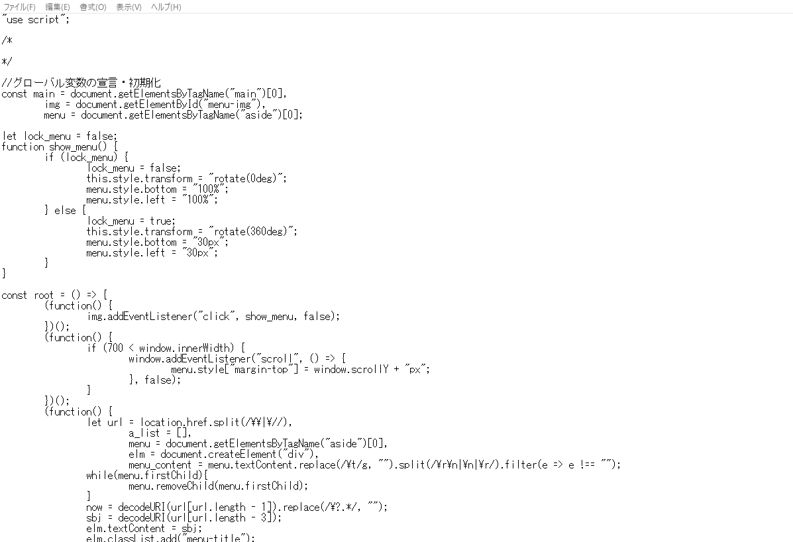
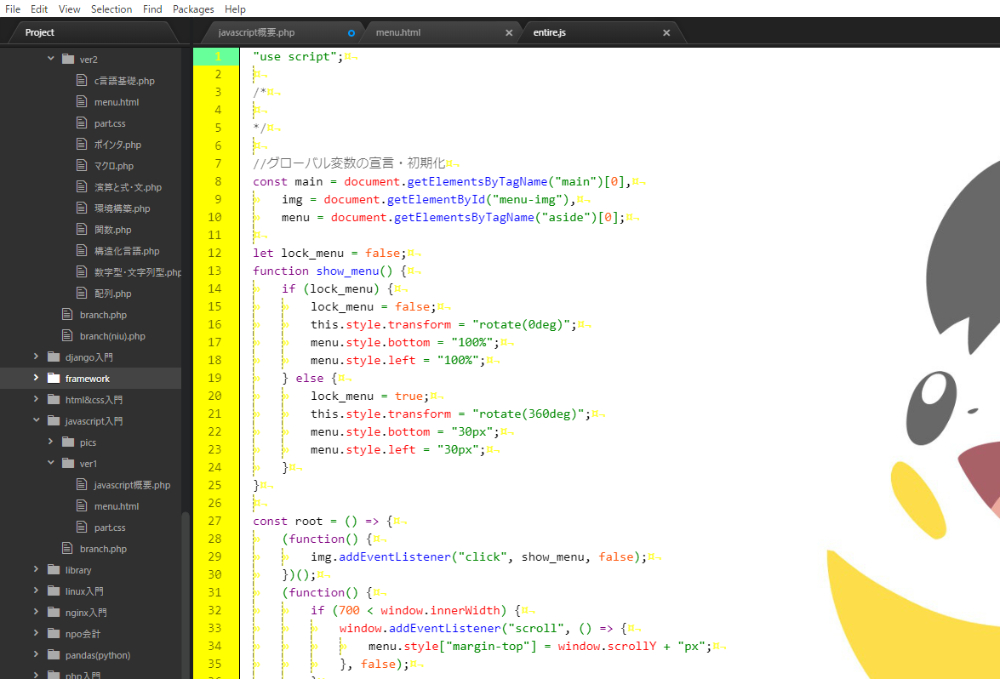

## 環境構築

環境構築というと大げさですが、簡単にHTML&CSSをコーディング・チェックする環境を整えましょう♪  
プログラミングは以下の2つの工程から成立します。  

1. 実際にコードを書く工程(コーディング)
2. 書いたコードが期待通りの動作をするかチェックする工程(デバグ)

※ 実際のシステム開発では「要件定義」や「設計」など、もっと詳細化した工程を踏みます。  

## エディタ

エディタとは実際にコードを書くためのプログラムです。  
Windowsならデフォルトでメモ帳が搭載されていますが、見づらいのでオススメしません。  

  

  

下のエディタの方が見やすいですよね♪  
有名なエディタとして以下のものがあられます。  

- [VSCode](https://code.visualstudio.com/)
- [Sublime Text](https://www.sublimetext.com/)
- [Atom](https://atom.io/)

僕は「VSCode」をオススメします。  

[VSCode](https://code.visualstudio.com/)  

---

左上の「File」タブから新しいファイルの作成、保存が可能です。  
ショートカットコマンドとして「Ctrl + N」で新規ファイルの作成、「Ctrl + S」で上書き保存、「Ctrl + Shift + S」で名前を付けて保存が可能です。  

効率化のためにできる限りショートカットコマンドを使用するようにしましょう。  

## ブラウザ

WindowsユーザならばPC購入時に標準で「Microsoft Edge」が搭載されていると思います。  
僕は「HTML」「CSS」「JavaScript」の開発者用のサイトであるMDNをよく利用するので、その開発元が運営しているFirefoxを使用することが多いです。  
一応主要なブラウザのダウンロードサイトを紹介します。  

- [Firefox](https://www.mozilla.org/ja/firefox/new/)
- [Google Chrome](https://www.google.com/intl/ja/chrome/)
- [Microsoft Edge](https://www.microsoft.com/ja-jp/edge)
- [Safari](https://support.apple.com/ja_JP/downloads/safari)

---

以上で環境構築は終了です。お疲れさまでした。
次はHTMLの基本について学びましょう♪
